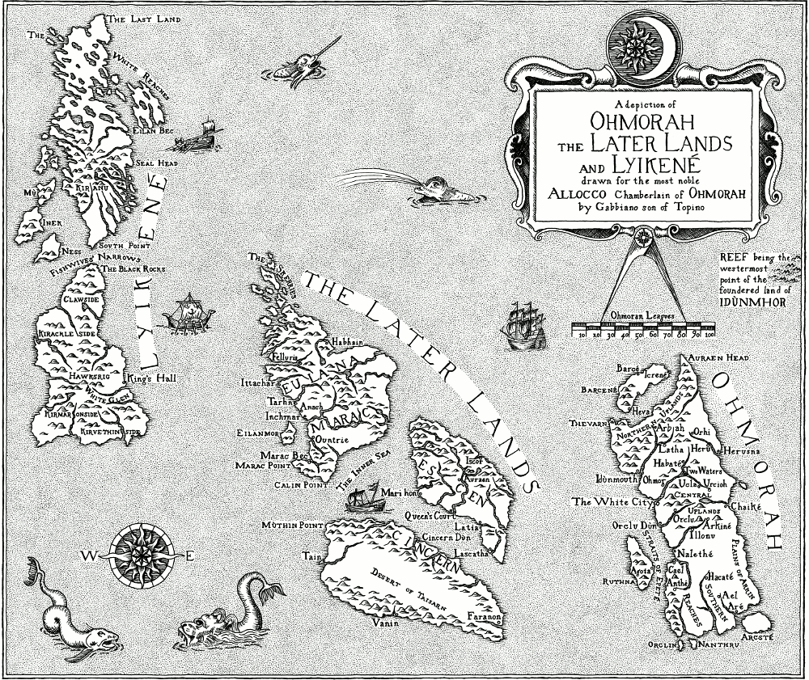

# Map of Ohmorah, the Later Lands and Lyikené

__Etching__

_Title:_ A depiction of Ohmorah, the Later Lands and Lyikené - drawn for the most noble Allocco Chamberlain of Ohmorah by Gabbiano, son of Topino

_Plate Size:_ 441 mm × 375 mm

_Paper Size:_ 550 mm × 500 mm

_Paper:_ Somerset Satin White, 300gsm, 100% cotton

_Edition:_ 20

_Price:_ £120 GBP

This is a full-size, original print of the map that appears in the novel, _After the Ruin_, by Harriet Goodchild. The map image has been photo-etched onto a copper plate and inked and printed by hand onto high-quality art paper in a limited edition of 20.

[Read a full description of how the map was made](../projects/mapping-an-imagined-land.md)

Prints can be supplied hand-coloured by the artist, using Schminke artist-quality watercolours, at an additional cost of £100 GBP.
