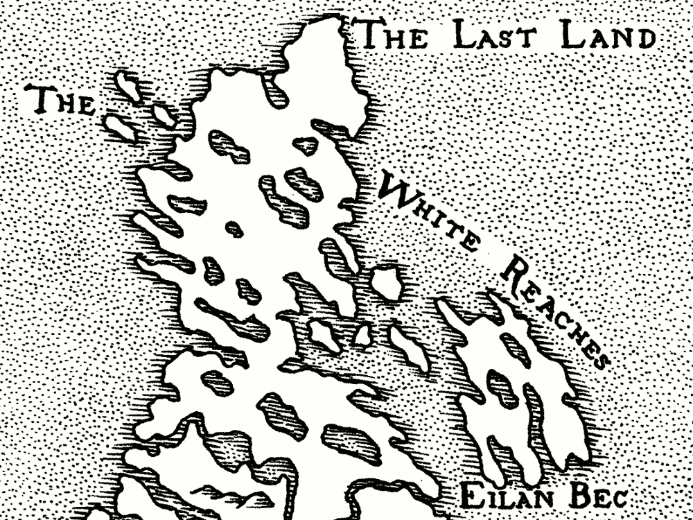
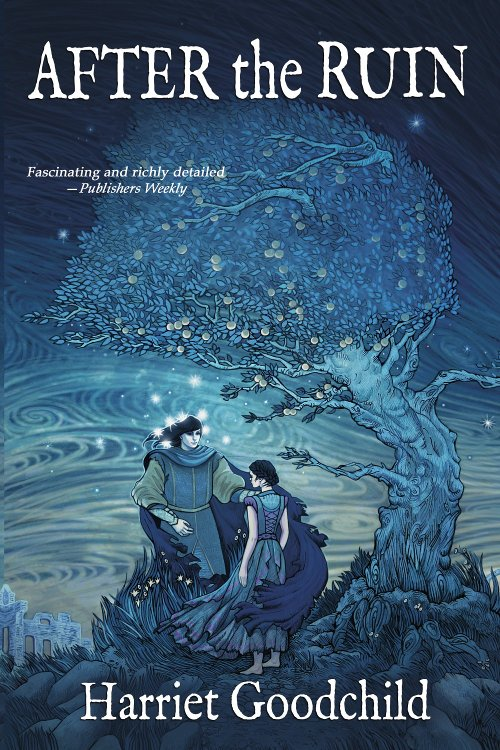
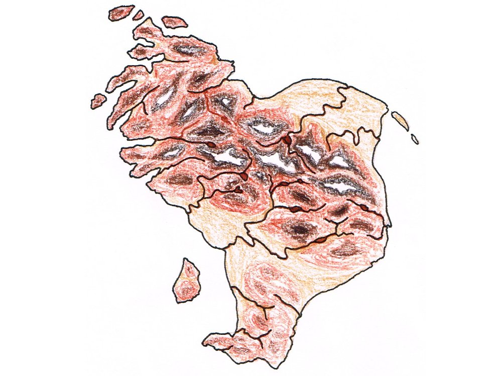
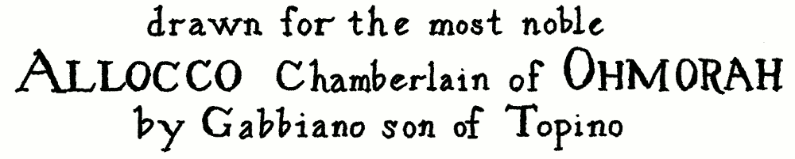
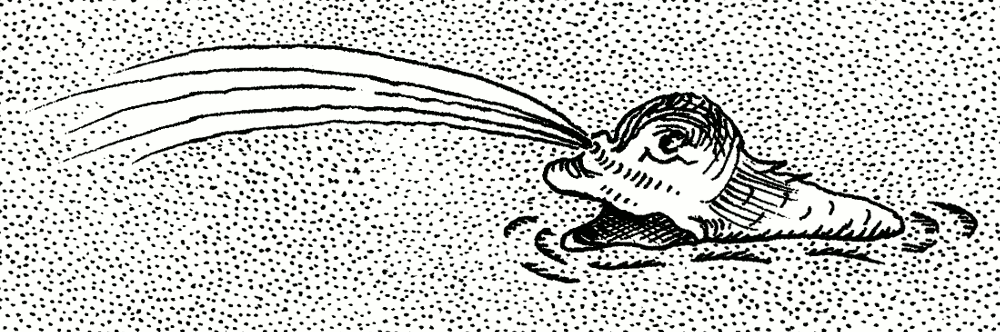
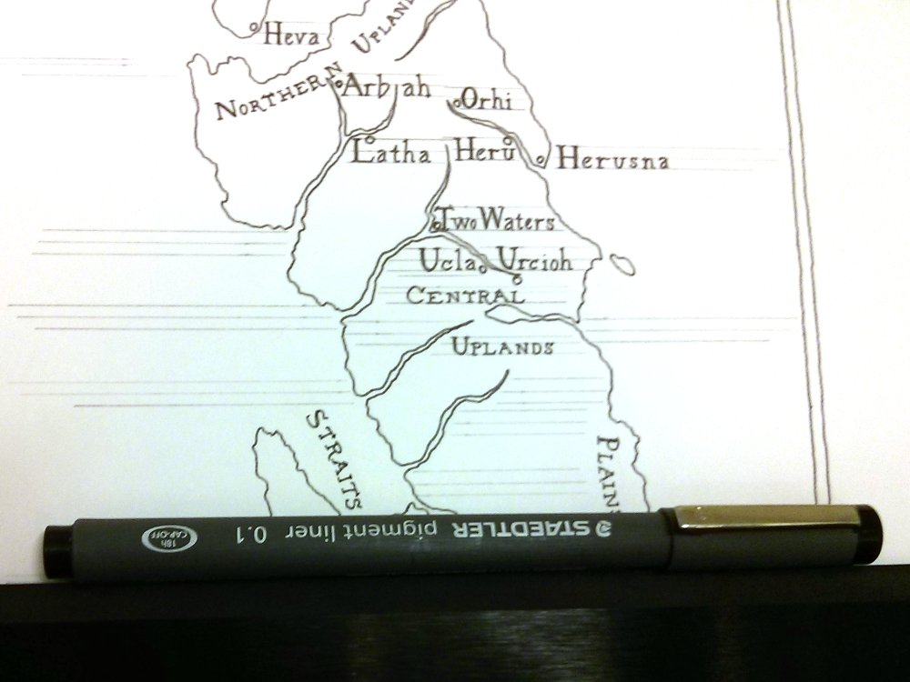
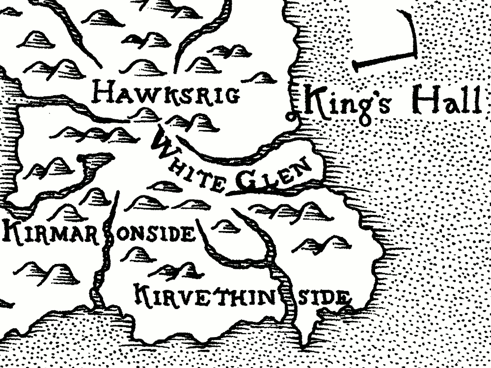
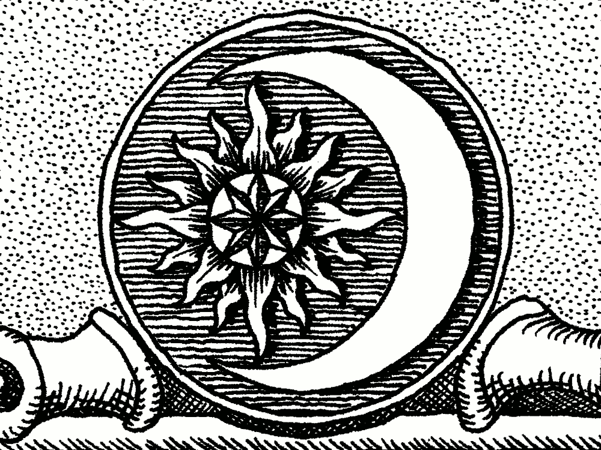
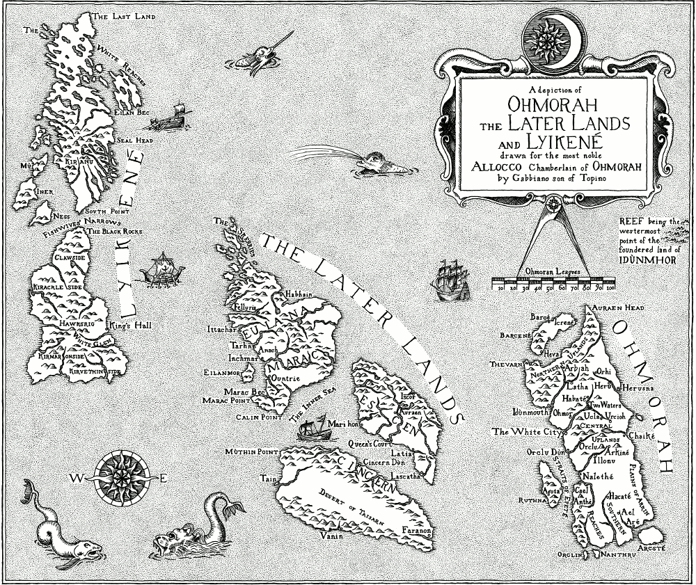

# Mapping an Imagined Land

Ever since Tolkien first plotted Bilbo's footsteps across Middle Earth, every fantasy novel has had to have a map. The trouble is that many fantasy maps don't match up to the imagined worlds they're depicting — they're just not _believable_. Mountains spring up from nowhere, rivers meander aimlessly across the page and great forests and swamps exist merely to dog the steps of the hapless heroes. The landscape shapes itself around the story, and not _vice versa_.

{: align=center }

When [Harriet Goodchild][2] asked me to draw a map for her new fantasy novel, [_After the Ruin_][3], we decided that we wanted to make one that was firmly and believably rooted in the world it was describing. Here's how we did it.

## World Building

The book describes a completely imaginary world in a time roughly equivalent to the European Renaissance of the 15th Century. The action spreads across several large island states, with seafaring trade links between them. Harriet had produced rough sketch maps of the three main regions — Ohmorah, Lyikené and The Later Lands — and described for me the general landscapes and the important places in the story. She had fortunately given a great deal of thought to the relationships between different locations and the travel times of characters in the story. This meant that we could eventually produce a map with a believable sense of _scale_.

## Under and Over the Surface

I've been very fortunate to have known a geologist for most of my life. She taught me to look at a landscape and think about how it formed. Rock layers get built up, bent, tilted, split apart, ground down and washed away — the landscape around us is the end result of all these geological and geophysical processes.

For the map, I tried to think about these processes in reverse. I had a rough idea of how the landscape should look now, but how did it get to be that way? Thinking about these things helped me to fill in the fine detail of the land forms, from ice-sculpted northern lands through fertile alluvial plains to an arid plateau in the rain shadow of a mountain chain thrust up at the edge of a tectonic plate.

I was then able to draw an "accurate" topographical map, on which I could lay out believable river courses, coastal features and smaller islands etc. On this topographical map, Harriet fleshed out the important placenames from the book with other towns and cities that may or may not be visited in future stories.

## Becoming the Mapmaker

We wanted the finished map to be drawn as if by a character from the world of the book, so Harriet invented Gabbiano, son of Topino, an artisan in the service of the Chamberlain of Ohmorah. Gabbiano would have drawn the map in the same way that many Renaissance maps were made: by combining his own observations of his local area with reports and maps from others based further afield. This process naturally led to bias and inaccuracies in the finished maps, which I wanted to try and emulate. To do this, I looked at early maps of a real area that I was familiar with to see how the topography had been changed and distorted.

I was lucky that the National Library of Scotland had a very good selection of [early maps of Scotland][4] which were scanned in high resolution and accessible for free on their website. These maps formed the main source material that inspired the finished map for the book. As I studied them, I saw the way that towns and cities were sometimes misplaced, lesser-explored areas were distorted and out of scale and inland features vague and generalised. Mountains and rivers were not drawn with any degree of realism, but merely gave a general sense of upland regions and watercourses. Coastlines were generally reasonably accurate on a large scale, but the fine detail was often reduced to a random wavy line.

From this research, I was then able to draw a draft map, based on the topographical one but seen through the eyes of Gabbiano: detailed and accurate for Ohmorah, which he knew well, and progressively more vague further afield. It incorporated some of the features and idiosyncracies I had seen from the early maps of Scotland. This then formed the basis for the final map.

## Becoming the Mapmaker's Engraver

As I looked at the early maps of Scotland, I realised that, in the end, I wasn't trying to make Gabbiano's original map. Early maps and drawings were reproduced in multiple copies by engraving the image into metal plates which were then wiped with ink and printed onto paper. This was done by highly skilled engravers who, although they prided themselves on being able to make accurate reproductions of other people's work, still revealed their own hand in the finished print. So for the final map I would have to try and become Gabbiano's _engraver_.

Engraved lines have a particular quality to them that is quite different from hand-drawn pen and ink lines. The engraver used a sharp tool called a burin to gouge fine marks into the surface of the metal. The ends of lines tapered to a point where the engraver lifted the burin off the plate, and there were sometimes gaps where the tool skipped across the surface. Dark areas in the drawing were made up using fine cross-hatching or parallel strokes, and text was painstakingly "drawn" letter by letter rather than simply written.

Once an engraved plate was finished, it had to be printed. The printer would smear the whole of the plate with thick, oily ink, and then carefully wipe it off again until only the engraved lines contained it. A sheet of damp paper, pressed into the plate, lifted the trapped ink out of the engraved lines to form the final image. The water-repellent ink sat neatly on the surface of the damp paper, rather than being absorbed into it and spidering out like pen ink would, allowing for very fine detail and giving the finished print a raised, textured feel rather like that of a letterpress book. A consequence of this printing process was that an engraving had to be made as a _mirror image_ of the finished print. Although engravers were incredibly skilled at reconstructing drawings in reverse, there were occasional mistakes and malformed or reversed letters where their concentration lapsed for a moment!

All of these things gave a printed engraving a peculiar character that I wanted to try and suggest, even if I couldn't entirely replicate, in the finished map drawing.

## Tooling Up

Although the map I was trying to emulate would have been engraved and printed, I would have to use pen and ink to draw mine. I always use [Bristol Board][5] as a base for pen and ink drawings — its smooth, hard surface allows for very fine pen work with little or no ink spread, while its heavy weight keeps it from buckling and stretching, and allows mistakes to be scraped and burnished away if necessary. I usually use a [Rotring Isograph][6] technical pen, but I felt that for this drawing it would be too precise and lifeless for what I was trying to achieve. I tried out a number of fine-tipped artist pens before settling on a [Staedtler pigment liner][7] with a 0.1mm tip.

{: align=center }

This turned out to be a very good choice. The nib is robust but very fine and responsive to variation in pressure, and the slightly faded black pigment ink doesn't flow out too freely, giving the lines a lovely changeable and "fragile" character. With a bit of practice I found that I could use changes in pressure and speed to emulate the qualities of the lines I had seen in engravings. I was impressed that a single pen lasted me for the whole project, including preparatory drawings and tests, without drying up or deteriorating in any way!

## The Lay of the Land

I knew that the map would eventually have to fit into the pages of the book, and the publisher had already given me the page dimensions and margins to use. However, I didn't want it to _look_ like the map had been made to fit. I laid out the drawing to show the page margins at exactly twice the finished dimensions (to make scanning and scaling it easier later) and then drew a frame for the map within those margins, but with a different shape.

Having drawn the frame, I then placed the major land areas within it. Given the amount of detail required, it was obvious that the map would have to be spread across a double page in the book, and so it would have a break down the middle. I deliberately allowed some features to fall across the break, though at the same time I tried to avoid places crucial to the story from being broken in this way.

Then it was just a matter of filling in the detail by copying from the draft map.

## Placing the Names

Once the outlines of the land were drawn in, it was time to add the text for the placenames. For my first test drawings I used a calligraphic pen to write the text, but no matter how hard I tried, it never looked right. Looking back at the old maps of Scotland I realised why: engravers could not simply write onto their printing plates as I was trying to do. They had to carve each letter out of the metal, much as a stonemason would (albeit on a much smaller scale). The letter forms they used were the classic roman and italic of carved inscriptions, rather than the looser forms of handwriting.

Each engraver had a recognisable style of lettering, and a carefully chosen hierarchy of text sizes and types to denote different features on the map. I found an example that I particularly liked, and used it as the basis for my own model alphabet. I added a few flourishes of my own, like the swooping descenders of "R" and "K", and experimented with letter heights until I could be sure all of the text could be fitted onto the map while keeping it legible when reduced to its finished size in the book.

Finding a way to fit all of the placenames onto the map without them running into each other or obscuring important features was difficult. I traced portions of the map and experimented with the placement until I found a way to make it work. Some text had to be curved carefully around or broken across landscape features, but where possible I tried to keep most place names horizontal and unbroken so that the map would be easily readable.

Drawing the lettering onto the finished map was extremely nerve-wracking. With handwriting you don't have to think too hard about the individual letters as you're writing, but with this I had to concentrate on the size, shape and spacing of each letter in order to fit the whole word into the available space. I was drawing the letters directly in pen, just using faint pencil guidelines to keep things straight and level, and mistakes would be difficult or impossible to fix later. I chose quiet moments with few distractions, and only added the lettering for a few placenames at a time, often finding myself holding my breath while I did it. I was mightily relieved once it was all done!

## Filling the Sea

Then came the fun part: bringing the map to life and giving it character. A map of simple outlines and text looks pretty flat and uninteresting, and is surprisingly hard to use. Centuries of mapmakers and their engravers have wrestled with this problem and developed inventive ways of embellishing their maps to make them more interesting, usable and beautiful.

Like many maps, I used a border of fine lines around the coastline and inland waterways to help make the land shapes stand out more. To shade in the sea and distinguish it from the land, old maps use a variety of techniques from simple dots to vibrating patterns of zig-zag lines. I've always enjoyed dot shading so I used that for our map, but it took some time! Every evening for more than two weeks I spent 1-2 hours simply drawing dots until my hand cramped up — it was a rather calm and meditative process. I tried hard to keep the shading looking even across the whole map, expanding out along borders and coastlines and bridging across gaps to close off smaller and smaller areas until they were eventually filled in.

	

		<ul class="splide__list">
			<li class="splide__slide"></li>
			<li class="splide__slide"></li>
			<li class="splide__slide"></li>
      <li class="splide__slide"></li>
		</ul>
	

To embellish the map, I'm afraid we stole shamelessly from those early maps of Scotland. It's hard to get into the imagination of someone from that time: the sea was a strange and dangerous place populated by unfamiliar creatures that grew wilder and more frightening with every fisherman's tall tale. Early maps are positively teeming with creatures for which grains of reality are distorted and expanded into terrifying sea monsters. Even the more decorative elements like the cartouches and borders around titles can look strange to our eyes. They often seemed to have been repeatedly copied and embellished from earlier maps until they have lost any resemblance to anything real or even logical!

In the end it seemed simpler just to cherry-pick the details that Harriet and I liked from different prints and copy or adapt them for our own use. However, we did give _some_ elements a twist to match the world the story is set in. For example, the symbol of Ohmorah is the sun in the arms of the crescent moon, for which I carefully constructed a motif based on circular geometry, and placed it above the title and dedication. The motion of the sun is important in the story, and so the sun motif was also used for the hinge of the dividers above the scale and for the compass rose, which points East-West rather than North.

## Full Circle

The drawing was finally done. Since the book would be typeset electronically, I scanned the map into the computer and used the opportunity to fix a few, _ahem_, mistakes, before reducing it to the right size and resolution for the book. Here is the finished map:

But why stop there? The map had been drawn to emulate the style of a printed engraving, and I thought it would be a good idea to make a limited-edition print of the map to sell alongside the book. While I don't have the skill to make a true engraving, I did live just a stone's throw away from the wonderful [Edinburgh Printmakers][9] - an open-access print studio and gallery in central Edinburgh. I did one of their courses in etching, and ever since I've been hooked, going back there at every opportunity to practise and improve my new-found skill.

The map is by far the biggest print I have attempted, but I'm very pleased with the way it has come out. See the print in my [Artworks](../artworks/map-of-ohmorah-the-later-lands-and-lyikene.md) list.

 [1]: http://www.amazon.com/After-Ruin-Harriet-Goodchild/dp/0989263150
 [2]: http://www.hmgoodchild.com "Harriet Goodchild's Folksong and Fantasy blog"
 [3]: http://www.amazon.com/After-Ruin-Harriet-Goodchild/dp/0989263150 "After the Ruin by Harriet Goodchild on Amazon.com"
 [4]: http://maps.nls.uk/scotland/index.html "Early Maps of Scotland on the National Library of Scotland Website"
 [5]: http://www.winsornewton.com/uk/shop/paper/drawing-sketching-paper/extra-smooth-bristol-boards "Bristol Board on the Winsor & Newton Website"
 [6]: http://www.rotring.com/en/technical-pens/50-isograph-pen-4006856151008.html "Isograph Pens on the Rotring Website"
 [7]: http://www.staedtler.com/en/products/ink-writing-instruments/fineliners/pigment-liner-308-fineliner/ "Pigment liner pen on the Staedtler Website"
 [9]: http://www.edinburghprintmakers.co.uk "Edinburgh Printmakers website"
